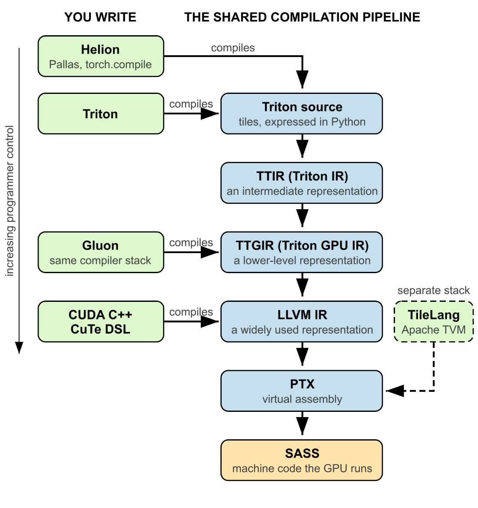

# Triton in Action

## What is Triton

## Triton Programming Model

## First Steps

### Vector Addition

## References

**《GPU Programming with Triton》**

GPU Programming with Triton: Accelerate AI training and inference. Harshwardhan Fartale. Manning Early Access Program (MEAP).

**Triton Project**

https://github.com/triton-lang/triton
https://triton-lang.org/

**《AI Systems Performance Engineering》**

AI Systems Performance Engineering: Optimizing Model Training and Inference Workloads with GPUs, CUDA, and PyTorch. Chris Fregly. 2025. O'Reilly.
