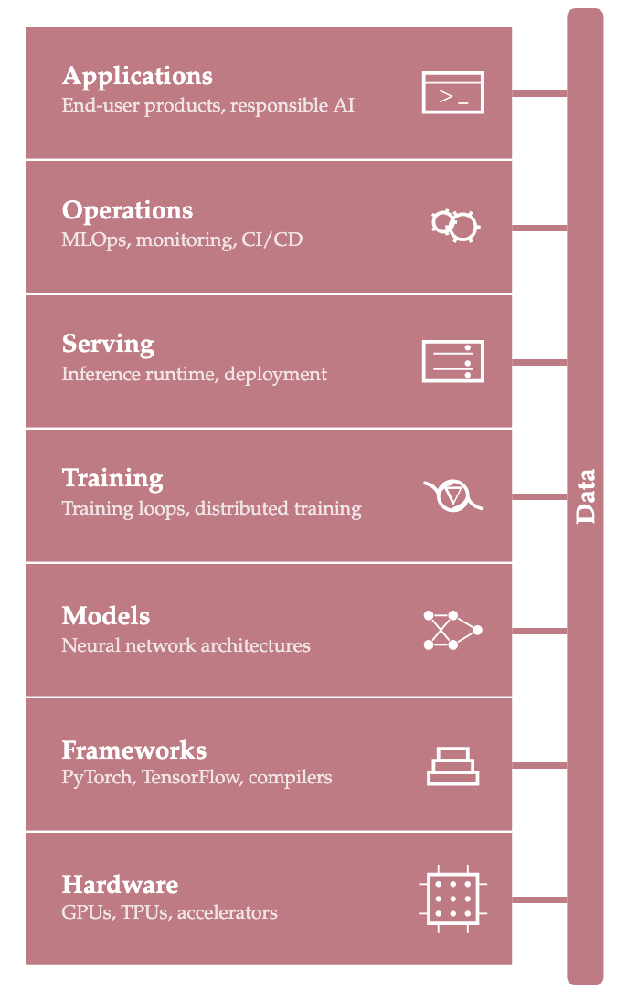

# AI System Fundamentals

## AI Systems Overview

现代AI的核心是深度学习，AI System本质上就是Machne Learning System。

什么是Machne Learning System？Reddi教授在《ML Systems》一书中，给出了ML Systems的一个定义，这个定义将数据、算法和硬件视为三大要素，相辅相成。

> Machine learning systems are software systems whose core behavior is determined by parameters learned from data rather than explicitly programmed rules, making performance a function of data quality, algorithm choice, and hardware capacity simultaneously.

ML Systems在整个AI生态中处于什么位置呢？Reddi教授给出了一个非常形象的比喻。整个AI生态从Silicon到Mission分为4层，Systems位于Hardware和Workloads之间。

* Hardware (The Silicon). The physical foundation (The Engine)。硬件比作引擎。
* Systems (The Platforms). The integrated deployment unit (The Car). 系统比作整车。
* Workloads (The Models). The algorithmic demand (The Route). 工作负载比作路线。
* Missions (The Scenarios). The application context (The Destination). 任务比作目的地。

ML Systems是怎么构建和运转起来的呢？Reddi教授给出了ML Systems stack. 硬件的前提，既是enabler也是constraints。框架对硬件提供了抽象，既方便开发模型，也针对硬件进行优化。模型需要经过训练，才能服务和运维。最终开发AI应用。

## 项目简介

AI系统的内容非常庞大，本项目的目标，不是面面俱到，也不是深入透彻，而是对AI系统的若干关键点进行初步探究，为进一步深入打下基础。

先了解AI的大局（01-big-icture）

* 01-ai-andscape
* 02-dl-Landscape

然后进入深度学习（02-deep-learning）这一核心领域，通过动手实践了解深度学习是怎么工作的。

* 01-dl-in-action: 用PyTorch API实现NN
* 02-ai4science-in-action: AI在Science领域的案例分析
* 03-nn-from-scratch: 用NumPy从零开始实现NN

接着进入GPU并行计算（03-gpu-computing），这是深度学习得以成功的关键要素之一

* 01-gpu-arch-essentials
* 02-cuda-in-action
* 03-triton-in-action

DL框架的一个视角是AI Compiler（04-ai-compiler）

* 01-pytorch-compiler-in-action

workload的重点正在从training转向serving（05-serving）

* 01-serving-in-action

## Summary

通过这个项目，对AI Systems总体上有了大致印象，对核心要素有初步认识。下一步有选择地深入更加细分的领域。侧重serving infrastructure和performance engineering，GPU Computing是下边界，Workload是上边界。

* [understanding-llm-workloads](https://github.com/seancxmao/understanding-llm-workloads). LLM是最重要的AI workload之一，这个项目深入理解LLM workload，它是深入LLM serving的前提。
* [llm-serving-deep-dive](https://github.com/seancxmao/llm-serving-deep-dive). 深入LLM inference and serving。
* [dl-framework-internals](https://github.com/seancxmao/dl-framework-internals). 模型的架构、inference和优化，都离不开DL框架。
* [gpu-programming](https://github.com/seancxmao/gpu-programming). LLM serving性能很大程度上依赖于GPU kernel。

## References

**《ML Systems》**

Introduction to Machine Learning Systems. Vijay Janapa Reddi. 2026.

**《AI Systems Performance Engineering》**

AI Systems Performance Engineering: Optimizing Model Training and Inference Workloads with GPUs, CUDA, and PyTorch. Chris Fregly. 2025. O'Reilly.

**《HOLLMSO》**

Hands-On LLM Serving and Optimization: Hosting LLMs at Scale. Chi Wang and Peiheng Hu. 2026.
